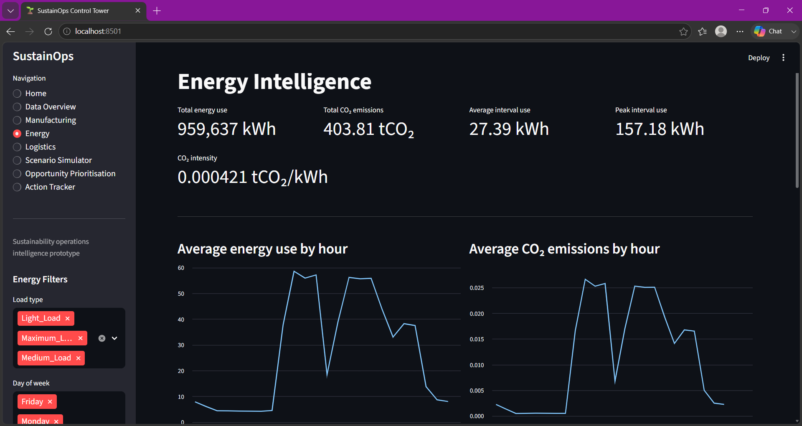
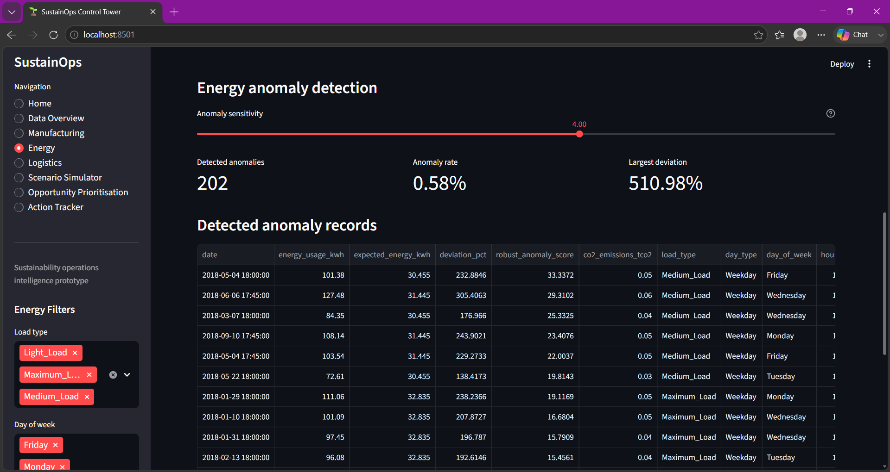

# SustainOps Control Tower

A Streamlit-based sustainability operations intelligence prototype for analysing manufacturing efficiency, industrial energy use, logistics performance, improvement opportunities, and corrective actions.

## Project Purpose

SustainOps Control Tower combines multiple operational datasets into one decision-support application. It helps users identify inefficient machines, unusual energy consumption, delivery risks, sustainability opportunities, and implementation actions.

## Main Features

## Application Screenshots

### Energy Intelligence Dashboard



### Energy Anomaly Detection




### Manufacturing Intelligence
- Production and material-efficiency KPIs
- Energy intensity and defect-rate analysis
- Machine performance scoring
- Critical-machine priority queue
- Recommended operational actions

### Energy Intelligence
- Energy-use and CO₂-emission KPIs
- Hourly consumption analysis
- Robust anomaly detection using median and MAD
- Anomaly severity reporting
- Investigation recommendations

### Logistics Intelligence
- Carrier and delivery-performance analysis
- Late-shipment risk scoring
- Shipment intervention queue
- Route-specific alternative-carrier recommendations
- Estimated transport time and cost comparison

### Scenario Simulator
- Energy-reduction scenarios
- CO₂ reduction estimates
- Annual financial savings
- Payback-period calculation
- Five-year net-benefit assessment

### Opportunity Prioritisation
- Sustainability opportunity ranking
- CO₂, cost, difficulty, and strategic-relevance scoring
- Priority recommendations

### Action Tracker
- Create and assign sustainability actions
- Set priority, status, owner, and deadline
- Track expected CO₂ reduction and cost savings
- Edit existing actions
- Permanent local CSV storage
- Duplicate-action and blank-row protection

## Technologies Used

- Python
- Streamlit
- pandas
- NumPy
- Plotly
- scikit-learn
- openpyxl
- Git and GitHub

## Project Structure

```text
sustainops-control-tower/
├── data/
│   ├── raw/
│   ├── processed/
│   ├── reference/
│   └── sample_uploads/
├── database/
├── reports/
│   └── documentation/
├── src/
│   ├── data_cleaning/
│   ├── data_inspection/
│   └── storage/
├── main.py
├── requirements.txt
└── README.md